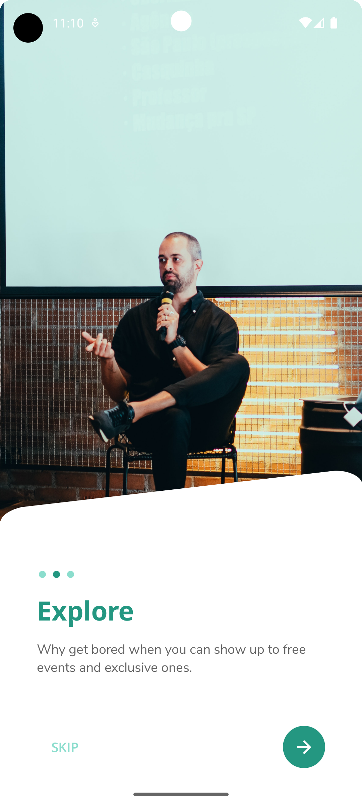
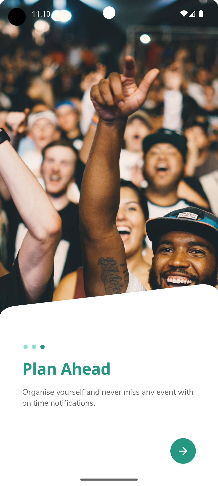
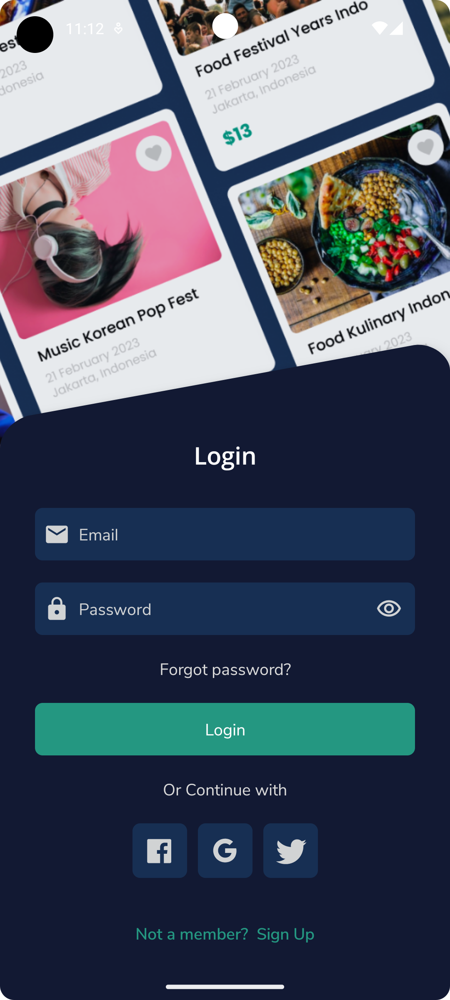
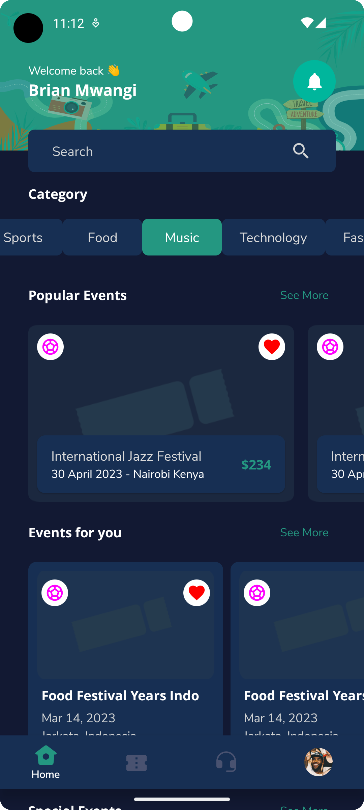
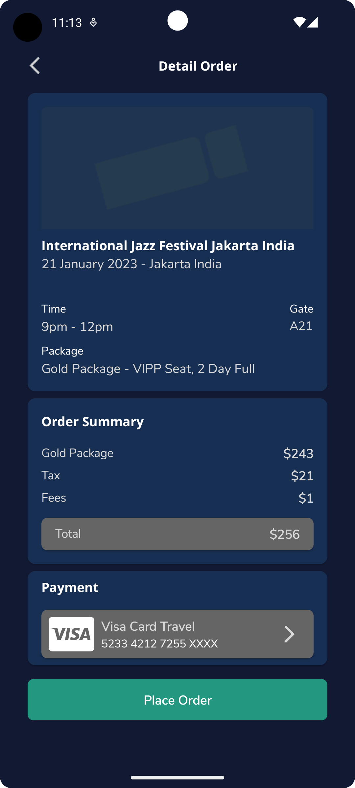
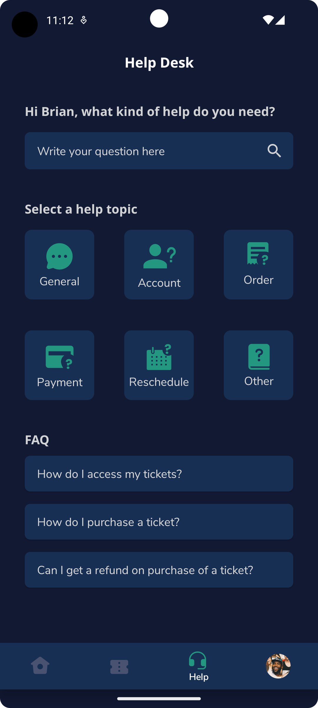
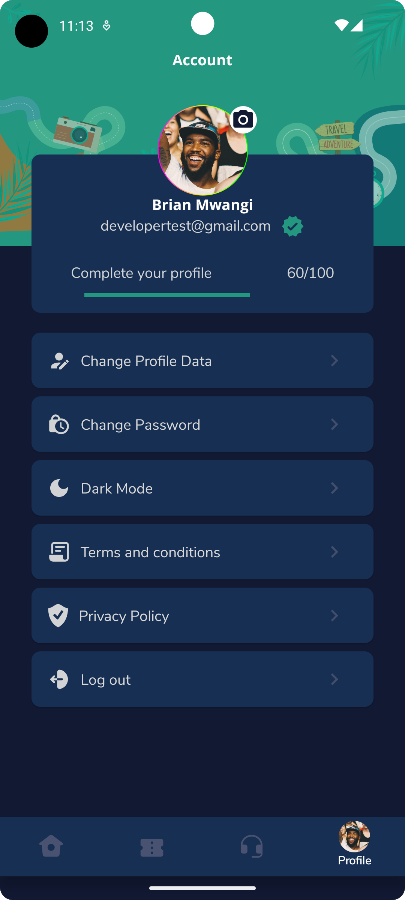

## Still under construction 🚧 🚧.

<h1 align="center">Evento android</h1>

Android Clean Architecture in 
Evento is a sample project that presents modern, approach to [Android](https://www.android.com/) application development using [Kotlin](https://kotlinlang.org/) and latest tech-stack.

An android app built using Kotlin that allows people to find events and pay for them.

## Environment Setup

You require the minimum Android Studio ```Electric Eel | 2022.1.1``` to be able to build the app.

## Architecture
A well planned architecture is extremely important for an app to scale and all architectures have one common goal- to manage complexity of your app. This isn't something to be worried about in smaller apps however it may prove very useful when working on apps with longer development lifecycle and a bigger team.

Clean architecture was proposed by [Robert C. Martin](https://en.wikipedia.org/wiki/Robert_C._Martin) in 2012 in the [Clean Code Blog](http://blog.cleancoder.com/uncle-bob/2012/08/13/the-clean-architecture.html) and it follow the SOLID principle.

<p align="center"></p>

The circles represent different layers of your app. Note that:

- The center circle is the most abstract, and the outer circle is the most concrete. This is called the [Abstraction Principle](https://en.wikipedia.org/wiki/Abstraction_principle_(computer_programming)). The Abstraction Principle specifies that inner circles should contain business logic, and outer circles should contain implementation details.

- Another principle of Clean Architecture is the [Dependency Inversion](https://en.wikipedia.org/wiki/Dependency_inversion_principle). This rule specifies that each circle can depend only on the nearest inward circle ie. low-level modules do not depend on high-level modules but the other way around.

<p align="center"></p>

### Why Clean Architecture?
- ```Loose coupling between the code``` - The code can easily be modified without affecting any or a large part of the app's codebase thus easier to scale the application later on.
- Easier to ```test``` code.
- ```Separation of Concern``` - Different modules have specific responsibilities making it easier for modification and maintenance.

### S.O.L.I.D Principles

- [__Single Responsibility__](https://en.wikipedia.org/wiki/Single-responsibility_principle): Each software component should have only one reason to change – one responsibility.

- [__Open-Closed__](https://en.wikipedia.org/wiki/Open%E2%80%93closed_principle#:~:text=In%20object%2Doriented%20programming%2C%20the,without%20modifying%20its%20source%20code.): You should be able to extend the behavior of a component, without breaking its usage, or modifying its extensions.

- [__Liskov Substitution__](https://en.wikipedia.org/wiki/Liskov_substitution_principle): If you have a class of one type, and any subclasses of that class, you should be able to represent the base class usage with the subclass, without breaking the app.

- [__Interface Segregation__](https://en.wikipedia.org/wiki/Interface_segregation_principle): It’s better to have many smaller interfaces than a large one, to prevent the class from implementing the methods that it doesn’t need.

- [__Dependency Inversion__](https://en.wikipedia.org/wiki/Dependency_inversion_principle): Components should depend on abstractions rather than concrete implementations. Also higher level modules shouldn’t depend on lower level modules.

## Layers

### Project Structure
<p align="center"></p>

### BuildSrc
The ```buildSrc``` layer is responsible for dependency management. It control and manage all dependencies in one place with Kotlin.

### Common
The ```common``` layer is responsible for common properties. It contains the implementations of the resources files, themes and components declared in the common layer.

- __component__: This is responsible for common view components that using app.

- __provider__: Defines navigation, resource and theme provider.

- __theme__: Defines themes, colors, fonts and resource files.

### Libraries
The ```libraries``` layer is responsible for base structure.

- __framework__: Contains different utilities that can be used by the different modules and base structures.

- __jetframework__: Contains different utilities that can be used by the different modules and base structures only for Jet Compose.

- __testing__: Contains the definitions of the test utilities.

### Data
The ```data``` layer is responsible for selecting the proper data source for the domain layer. It contains the implementations of the repositories declared in the domain layer.

Components of data layer include:
- __model__

  -__dto__: Defines dto of ui model, also perform data transformation between ```domain```, ```response``` and ```entity``` models.

  -__local__: Defines the schema of SQLite database.

  -__remote__: Defines POJO of network responses.

- __local__: This is responsible for performing caching operations using [Room](https://developer.android.com/training/data-storage/room).

- __remote__: This is responsible for performing network operations eg. defining API endpoints using [Retrofit](https://square.github.io/retrofit/).

- __repository__: Responsible for exposing data to the domain layer.

### Domain
This is the core layer of the application. The ```domain``` layer is independent of any other layers thus ] domain business logic can be independent from other layers.This means that changes in other layers will have no effect on domain layer eg.  screen UI (presentation layer) or changing database (data layer) will not result in any code change withing domain layer.

Components of domain layer include:
- __usecase__: They enclose a single action, like getting data from a database or posting to a service. They use the repositories to resolve the action they are supposed to do. They usually override the operator ```invoke``` , so they can be called as a function.

### Presentation
The ```features``` layer contains components involved in showing information to the user. The main part of this layer are the views(activity, compose) and ViewModels.

## Demo Screenshots











# Tech Stacks
This project uses many of the popular libraries, plugins and tools of the android ecosystem.

- [Compose](https://developer.android.com/jetpack/compose)

    - [Material](https://developer.android.com/jetpack/androidx/releases/compose-material) - Build Jetpack Compose UIs with ready to use Material Design Components.
    - [Foundation](https://developer.android.com/jetpack/androidx/releases/compose-foundation) - Write Jetpack Compose applications with ready to use building blocks and extend foundation to build your own design system pieces.
    - [UI](https://developer.android.com/jetpack/androidx/releases/compose-ui) - Fundamental components of compose UI needed to interact with the device, including layout, drawing, and input.
    - [ConstraintLayout](https://developer.android.com/jetpack/androidx/releases/constraintlayout) - ConstraintLayout-compose 1.0 provides ConstraintLayout functionalities in Jetpack Compose.
    - [Lifecycle-ViewModel](https://developer.android.com/jetpack/androidx/releases/lifecycle) - Perform actions in response to a change in the lifecycle status of another component, such as activities and fragments.
    - [Paging](https://developer.android.com/topic/libraries/architecture/paging/v3-overview) - The Paging Library makes it easier for you to load data gradually and gracefully within your app's [RecyclerView](https://developer.android.com/reference/androidx/recyclerview/widget/RecyclerView).
    - [Lottie](https://github.com/airbnb/lottie/blob/master/android-compose.md) - Lottie is a mobile library for Android and iOS that parses Adobe After Effects animations exported as json with Bodymovin and renders them natively on mobile!
    - [Coil](https://coil-kt.github.io/coil/compose/) - An image loading library for Android backed by Kotlin Coroutines.

- [Accompanist](https://google.github.io/accompanist)

    - [SwipeRefresh](https://google.github.io/accompanist/swiperefresh/) - A library which provides a layout which provides the swipe-to-refresh UX pattern, similar to Android's SwipeRefreshLayout.
    - [Systemuicontroller](https://google.github.io/accompanist/systemuicontroller/) - System UI Controller provides easy-to-use utilities for updating the System UI bar colors within Jetpack Compose.
    - [Insets](https://google.github.io/accompanist/insets/) - Insets for Jetpack Compose takes a lot of the ideas which drove Insetter for views, and applies them for use in composables.
    - [Placeholder](https://google.github.io/accompanist/placeholder/) - A library which provides a modifier for display 'placeholder' UI while content is loading.
    - [Navigation](https://google.github.io/accompanist/navigation-material/) - A library which provides Compose Material support for Jetpack Navigation Compose. This features composable bottom sheet destinations.

- [Jetpack](https://developer.android.com/jetpack)

    - [Android KTX](https://developer.android.com/kotlin/ktx.html) - Provide concise, idiomatic Kotlin to Jetpack and Android platform APIs.
    - [AndroidX](https://developer.android.com/jetpack/androidx) - Major improvement to the original Android [Support Library](https://developer.android.com/topic/libraries/support-library/index), which is no longer maintained.
    - [Lifecycle](https://developer.android.com/topic/libraries/architecture/lifecycle) - Perform actions in response to a change in the lifecycle status of another component, such as activities and fragments.
    - [ViewModel](https://developer.android.com/topic/libraries/architecture/viewmodel) - Designed to store and manage UI-related data in a lifecycle conscious way. The ViewModel class allows data to survive configuration changes such as screen rotations.
    - [Room](https://developer.android.com/training/data-storage/room) - Provides an abstraction layer over SQLite used for offline data caching.

- [Dagger Hilt](https://dagger.dev/hilt/) - Dependency Injection library.
- [Google-KSP](https://github.com/google/ksp/) - Kotlin Symbol Processing API
- [Coroutines](https://github.com/Kotlin/kotlinx.coroutines) - Library Support for coroutines.
- [Flow](https://developer.android.com/kotlin/flow) - Flows are built on top of coroutines and can provide multiple values. A flow is conceptually a stream of data that can be computed asynchronously.
- [Material Design](https://material.io/develop/android/docs/getting-started/) - Build awesome beautiful UIs.
- [Coroutines](https://github.com/Kotlin/kotlinx.coroutines) - Library Support for coroutines,provides runBlocking coroutine builder used in tests.
- [Gradle Kotlin DSL](https://gradle.org/kotlin/) - makes it easy to manage dependency all module that we have

- [Navigation](https://github.com/raamcosta/compose-destinations) - Annotation processing library for type-safe Jetpack Compose navigation with no boilerplate.
- [SplashScreen](https://developer.android.com/guide/topics/ui/splash-screen) - Android 12 adds the SplashScreen API, which enables a new app launch animation for all apps when running on a device with Android 12 or higher.


### Plugin
- [Check-Dependency-Versions](https://github.com/ben-manes/gradle-versions-plugin) - make easy to determine which dependencies have updates.


